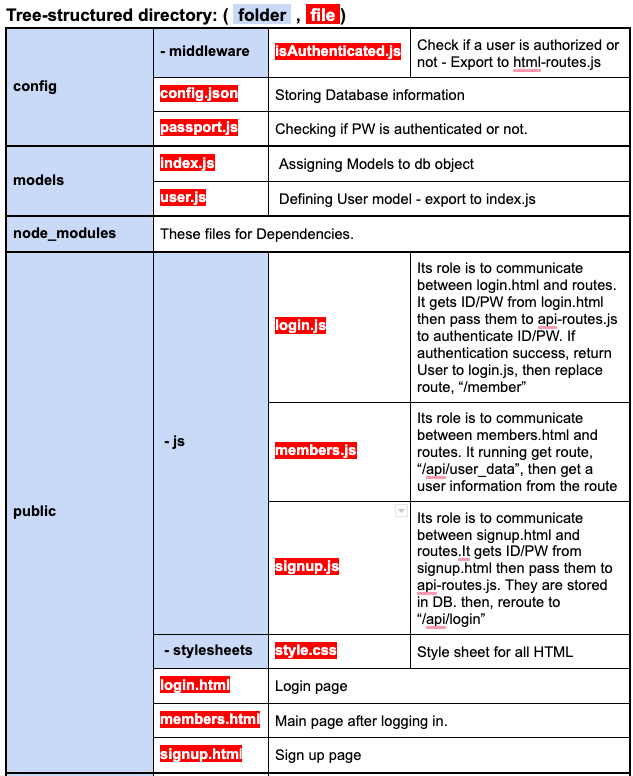
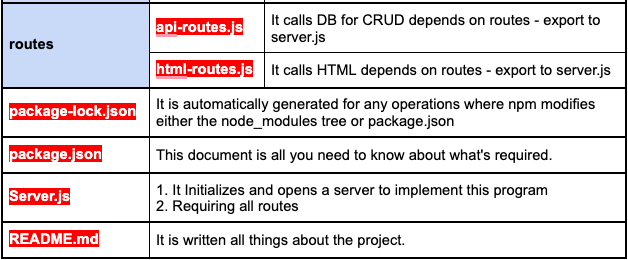

# starterCode

# Dependencies 
- bcryptjs, express, express-session, mysql2, passport, passport-local, seuqlize

# USER STORY

AS A developer
I WANT a walk-through of the codebase
SO THAT I can use it as a starting point for a new project

GIVEN a Node.js application using Sequelize and Passport
WHEN I run “npm install”
THEN I can get dependencies 
WHEN I open the config folder and update the config.json file’s ‘development’ object to match your own local MySQL database
THEN I can use the schema of the DB
WHEN I define a model of a JS file in models directory.
THEN I can use db.{NewModelName} with Sequelize method
WHEN I open my terminal and run node server and navigate to localhost:8080
THEN I can use the app
